# voice-assistant

## Process Flow

The voice assistant follows a three-stage pipeline to process user queries:

```mermaid
flowchart TD
    A[👤 User] -->|"🎤 Voice Query"| B[🎵 Speech to Text]
    B -->|"📝 Transcribed Text"| C[🧠 Text to Text LLM]
    C -->|"💭 Generated Response"| D[🔊 Text to Speech]
    D -->|"🎵 Audio Response"| A
    
    subgraph "Stage 1: Input Processing"
        B["🎵 Speech to Text<br/>(Lightweight STT Model)"]
    end
    
    subgraph "Stage 2: Intelligence"
        C["🧠 Text to Text LLM<br/>(Powerful Model like DeepSeek R1)<br/>Complex reasoning & answers"]
    end
    
    subgraph "Stage 3: Output Generation"
        D["🔊 Text to Speech<br/>(Lightweight TTS Model)"]
    end
    
    style A fill:#4CAF50,stroke:#2E7D32,stroke-width:3px,color:#fff
    style B fill:#9C27B0,stroke:#6A1B9A,stroke-width:2px,color:#fff
    style C fill:#2196F3,stroke:#1565C0,stroke-width:2px,color:#fff
    style D fill:#FF9800,stroke:#E65100,stroke-width:2px,color:#fff
```

### Components

1. **Speech to Text (STT)**: Converts user's voice input to text using a lightweight, efficient model
2. **Text to Text (LLM)**: Processes the transcribed text using a powerful language model (like DeepSeek R1) for complex reasoning and answer generation
3. **Text to Speech (TTS)**: Converts the LLM's response back to audio using a lightweight synthesis model