# 🎤 Voice Assistant

A modern AI-powered voice assistant with modular STT, LLM, and TTS components. Features both web interface and CLI demos.

## 🚀 Quick Start

```bash
# Install Deno
curl -fsSL https://deno.land/install.sh | sh

# Set up all models (interactive menu)
deno task setup

# Run the web interface
deno task web
# Open http://localhost:8000

# Or try Fresh UI (newer, better performance)
cd fresh-voice-assistant && deno task start
# Open http://localhost:8001
```

## 📋 Overview

The voice assistant follows a three-stage pipeline:

```mermaid
flowchart TD
    A[👤 User] -->|"🎤 Voice Query"| B[🎵 Speech to Text]
    B -->|"📝 Transcribed Text"| C[🧠 Text to Text LLM]
    C -->|"💭 Generated Response"| D[🔊 Text to Speech]
    D -->|"🎵 Audio Response"| A
    
    subgraph "Stage 1: Input Processing"
        B["🎵 Speech to Text<br/>(Whisper, Vosk, etc.)"]
    end
    
    subgraph "Stage 2: Intelligence"
        C["🧠 Text to Text LLM<br/>(Ollama: Mistral, Llama2, etc.)"]
    end
    
    subgraph "Stage 3: Output Generation"
        D["🔊 Text to Speech<br/>(Coqui TTS, Piper, Chatterbox)"]
    end
    
    style A fill:#4CAF50,stroke:#2E7D32,stroke-width:3px,color:#fff
    style B fill:#9C27B0,stroke:#6A1B9A,stroke-width:2px,color:#fff
    style C fill:#2196F3,stroke:#1565C0,stroke-width:2px,color:#fff
    style D fill:#FF9800,stroke:#E65100,stroke-width:2px,color:#fff
```



## 🏗️ Project Structure

```
voice-assistant/
├── fresh-voice-assistant/    # 🌟 Fresh framework web UI (recommended)
│   ├── routes/              # API endpoints and pages
│   ├── islands/             # Interactive components
│   └── components/          # UI components
├── web/                     # Original web interface
├── scripts/                 # Core functionality
│   ├── demo/               # Individual component demos
│   ├── setup/              # Model setup scripts
│   └── test/               # Testing utilities
└── deno.json               # Tasks and configuration
```

## 🛠️ Available Commands

### Setup & Configuration
```bash
deno task setup              # Interactive setup menu
deno task setup whisper      # Set up Whisper STT
deno task setup ollama       # Set up Ollama LLM
deno task setup coqui-tts    # Set up Coqui TTS
```

### Demos & Testing
```bash
# Web Interfaces
deno task web                # Original web UI (port 8000)
cd fresh-voice-assistant && deno task start  # Fresh UI (port 8001)

# Complete Pipeline Demos
deno task demo:conversation  # Voice-to-voice conversation
deno task demo:realtime      # Live microphone input

# Component Demos
deno task demo:stt           # Speech-to-text demo
deno task demo:tts           # Text-to-speech demo
deno task demo:chatterbox    # Emotion-controlled TTS

# Testing
deno task test:roundtrip     # Test complete pipeline
```

## 📚 Documentation

- [Setup Guide](docs/SETUP.md) - Detailed setup instructions
- [API Reference](docs/API.md) - API endpoints and usage
- [Development Guide](docs/DEVELOPMENT.md) - Contributing and development
- [Model Guide](docs/MODELS.md) - Available models and configuration

## 🎯 Features

### Speech Recognition (STT)
- **Whisper** - OpenAI's robust model (recommended)
- **Vosk** - Lightweight offline recognition
- **Coqui STT** - Customizable STT
- **DeepSpeech** - Mozilla's offline STT

### Language Models (LLM)
- **Ollama** - Local LLM runner
  - Mistral, Llama2, DeepSeek R1, and more
  - Customizable system prompts

### Text-to-Speech (TTS)
- **Coqui TTS** - High-quality neural TTS
- **Piper** - Fast neural synthesis
- **Chatterbox** - Emotion-controlled TTS with voice cloning
- **espeak-ng** - Lightweight traditional TTS

## 🖥️ System Requirements

- **Deno** 2.0+ (JavaScript/TypeScript runtime)
- **Python** 3.11 (for ML models, 3.12+ has compatibility issues)
- **FFmpeg** (audio processing)
- **4GB+ RAM** for basic models
- **GPU** optional but recommended for Chatterbox TTS

## 📝 License

MIT License - See [LICENSE](LICENSE) file for details.