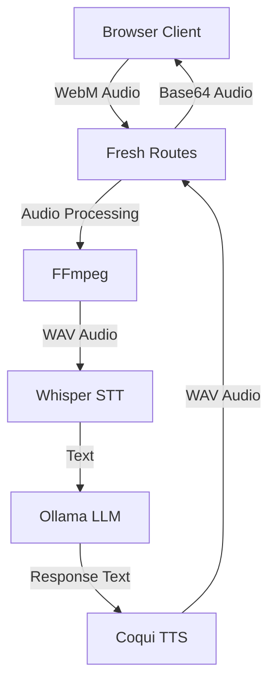

# Development Guide

This guide covers development setup, architecture, and contribution guidelines.

## Development Setup

### Prerequisites

1. Fork and clone the repository
2. Install development dependencies
3. Set up pre-commit hooks

```bash
# Clone your fork
git clone https://github.com/yourusername/voice-assistant.git
cd voice-assistant

# Install Deno
curl -fsSL https://deno.land/install.sh | sh

# Set up Python environment
python3.11 -m venv venv
source venv/bin/activate

# Install dependencies
deno task setup
```

## Architecture Overview

### Component Architecture



### Directory Structure

```
voice-assistant/
├── fresh-voice-assistant/    # Fresh web UI
│   ├── routes/              # API & page routes
│   │   ├── api/            # REST endpoints
│   │   └── index.tsx       # Main page
│   ├── islands/            # Interactive components
│   ├── components/         # Static components
│   └── signals/            # State management
├── scripts/                # Core functionality
│   ├── demo/              # Demo scripts
│   ├── setup/             # Setup utilities
│   └── test/              # Test scripts
├── web/                   # Original web UI
└── docs/                  # Documentation
```

### Key Technologies

- **Deno**: Runtime and task runner
- **Fresh**: Web framework with islands architecture
- **Preact**: UI library with signals for state
- **Python**: ML model execution
- **FFmpeg**: Audio format conversion

## Code Style Guide

### TypeScript/JavaScript

Follow Deno's style guide:

```typescript
// Good
export function processAudio(data: Uint8Array): Promise<string> {
  // Implementation
}

// Bad
export function process_audio(data) {
  // Implementation
}
```

### File Naming
- Components: `PascalCase.tsx`
- Utilities: `camelCase.ts`
- Routes: `kebab-case.ts`

### Formatting
```bash
# Format code
deno fmt

# Lint code
deno lint

# Type check
deno check **/*.ts
```

## Adding New Features

### 1. Adding a New STT Model

Create a setup script in `scripts/setup/stt/`:

```typescript
// scripts/setup/stt/new-model.ts
import { $ } from "@dax";

export async function setupNewModel() {
  console.log("Setting up New Model STT...");
  
  // Install dependencies
  await $`pip install new-model-package`.quiet();
  
  // Download models
  await $`wget -O model.bin https://example.com/model.bin`.quiet();
  
  console.log("✅ New Model STT ready!");
}
```

### 2. Adding a New API Endpoint

Create a route in `fresh-voice-assistant/routes/api/`:

```typescript
// routes/api/new-feature.ts
import { Handlers } from "$fresh/server.ts";

export const handler: Handlers = {
  async POST(req) {
    try {
      const data = await req.json();
      
      // Process request
      const result = await processFeature(data);
      
      return new Response(JSON.stringify({
        success: true,
        result
      }), {
        headers: { "Content-Type": "application/json" }
      });
    } catch (error) {
      return new Response(JSON.stringify({
        success: false,
        error: error.message
      }), {
        status: 500,
        headers: { "Content-Type": "application/json" }
      });
    }
  }
};
```

### 3. Adding a New UI Component

Create an island for interactive components:

```typescript
// islands/NewFeature.tsx
import { Signal } from "@preact/signals";
import { IS_BROWSER } from "$fresh/runtime.ts";

interface Props {
  state: Signal<string>;
}

export default function NewFeature({ state }: Props) {
  if (!IS_BROWSER) return null;
  
  return (
    <div class="new-feature">
      <button onClick={() => state.value = "clicked"}>
        Click me
      </button>
      <p>State: {state.value}</p>
    </div>
  );
}
```

## Testing

### Unit Tests

```typescript
// utils/audio.test.ts
import { assertEquals } from "$std/assert/mod.ts";
import { convertAudio } from "./audio.ts";

Deno.test("convertAudio converts WebM to WAV", async () => {
  const webm = new Uint8Array([/* test data */]);
  const wav = await convertAudio(webm);
  
  assertEquals(wav[0], 0x52); // 'R'
  assertEquals(wav[1], 0x49); // 'I'
  assertEquals(wav[2], 0x46); // 'F'
  assertEquals(wav[3], 0x46); // 'F'
});
```

Run tests:
```bash
deno test
```

### Integration Tests

```bash
# Test complete pipeline
deno task test:roundtrip

# Test with specific models
deno task test:roundtrip --whisper small --tts piper
```

## Debugging

### Enable Debug Logging

```typescript
// Set debug flag
const DEBUG = Deno.env.get("DEBUG") === "true";

function debugLog(...args: any[]) {
  if (DEBUG) console.log(...args);
}
```

Run with debug:
```bash
DEBUG=true deno task start
```

### Fresh Logs

```bash
# View real-time logs
deno task logs

# Or manually
tail -f /tmp/fresh_voice_logs.txt
```

## Performance Optimization

### Audio Processing
- Use streaming where possible
- Implement chunked processing for large files
- Cache converted audio formats

### Model Loading
- Lazy load models on first use
- Keep models in memory between requests
- Use model quantization for faster inference

### Frontend
- Use Islands architecture for minimal JS
- Implement virtual scrolling for long conversations
- Debounce user inputs

## Common Issues

### Memory Leaks
- Clean up MediaRecorder instances
- Release audio contexts
- Clear old conversation history

### Race Conditions
- Use proper state management
- Implement request queuing
- Add request cancellation

## Contributing

### Pull Request Process

1. Fork the repository
2. Create a feature branch
3. Make your changes
4. Add tests
5. Run formatting and linting
6. Submit PR with clear description

### Commit Messages

Follow conventional commits:
```
feat: add emotion detection to TTS
fix: resolve audio playback on Safari
docs: update API reference
refactor: split VoiceRecorder component
test: add STT accuracy tests
```

### Code Review Checklist

- [ ] Tests pass
- [ ] Code is formatted
- [ ] No linting errors
- [ ] Documentation updated
- [ ] Performance impact considered
- [ ] Security implications reviewed

## Release Process

1. Update version in `deno.json`
2. Update CHANGELOG.md
3. Tag release: `git tag v1.2.3`
4. Push tags: `git push --tags`

## Resources

- [Deno Documentation](https://deno.land/manual)
- [Fresh Framework](https://fresh.deno.dev/)
- [Whisper Documentation](https://github.com/openai/whisper)
- [Ollama API](https://github.com/ollama/ollama/blob/main/docs/api.md)
- [Coqui TTS](https://github.com/coqui-ai/TTS)